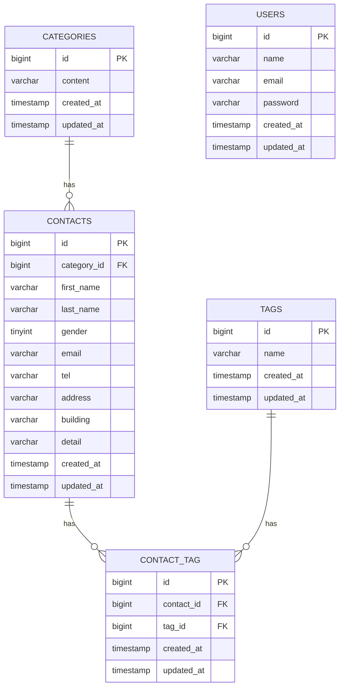

# お問い合わせフォーム

## 概要

お問い合わせ内容の入力・確認・登録を行うWebアプリケーションです。
管理者はお問い合わせの検索・詳細確認・削除、タグの管理を行うことができます。

## アプリケーションURL

- お問い合わせフォーム：http://localhost/
- 管理画面：http://localhost/admin
- ユーザー登録：http://localhost/register
- ログイン：http://localhost/login
- phpMyAdmin：http://localhost:8080

## 機能一覧

- お問い合わせ機能
    - お問い合わせ入力
    - 入力内容のバリデーション
    - お問い合わせ内容確認
    - お問い合わせ登録
    - サンクスページ表示
    - カテゴリ選択
    - タグ選択
- 認証機能
    - ユーザー登録
    - ログイン
    - ログアウト
- 管理機能
    - お問い合わせ一覧表示
    - キーワード検索
    - 性別検索
    - お問い合わせ種類検索
    - 日付検索
    - ページネーション
    - お問い合わせ詳細表示
    - お問い合わせ削除
    - CSVエクスポート
    - タグの追加・編集・削除
- API機能
    - お問い合わせ一覧取得
    - お問い合わせ詳細取得
    - お問い合わせ新規登録
    - お問い合わせ更新
    - お問い合わせ削除
    - 検索・絞り込み
    - ページネーション

## 使用技術

- PHP 8.2
- Laravel 10.x
- Laravel Fortify
- MySQL 8.4
- Nginx
- Laravel Sail
- Docker
- Vite
- Tailwind CSS 3.4
- Alpine.js
- phpMyAdmin

## 環境構築

### Dockerビルド

1. リポジトリをクローン

```bash
git clone git@github.com:yo-hiraoka/contact-form-app.git
```

2. プロジェクトディレクトリへ移動

```bash
cd contact-form-app
```

3. Composerパッケージをインストール

```bash
docker run --rm \
    -u "$(id -u):$(id -g)" \
    -v "$(pwd):/var/www/html" \
    -w /var/www/html \
    laravelsail/php82-composer:latest \
    composer install --ignore-platform-reqs
```

### Laravel環境構築

1. `.env` ファイルを作成

```bash
cp .env.example .env
```

2. `.env` のデータベース設定を変更

```env
DB_CONNECTION=mysql
DB_HOST=mysql
DB_PORT=3306
DB_DATABASE=laravel
DB_USERNAME=sail
DB_PASSWORD=password
```

3. Dockerコンテナを起動

```bash
./vendor/bin/sail up -d
```

4. アプリケーションキーを生成

```bash
./vendor/bin/sail artisan key:generate
```

5. マイグレーションとシーディングを実行

```bash
./vendor/bin/sail artisan migrate --seed
```

6. npmパッケージをインストール

```bash
./vendor/bin/sail npm install
```

7. Vite開発サーバーを起動

```bash
./vendor/bin/sail npm run dev
```

## ER図



## テーブル仕様

### users

| カラム名   | 型           | PRIMARY KEY | UNIQUE KEY | NOT NULL |
| ---------- | ------------ | ----------- | ---------- | -------- |
| id         | bigint       | ○           |            | ○        |
| name       | varchar(255) |             |            | ○        |
| email      | varchar(255) |             | ○          | ○        |
| password   | varchar(255) |             |            | ○        |
| created_at | timestamp    |             |            |          |
| updated_at | timestamp    |             |            |          |

### categories

| カラム名   | 型           | PRIMARY KEY | UNIQUE KEY | NOT NULL |
| ---------- | ------------ | ----------- | ---------- | -------- |
| id         | bigint       | ○           |            | ○        |
| content    | varchar(255) |             |            | ○        |
| created_at | timestamp    |             |            |          |
| updated_at | timestamp    |             |            |          |

### contacts

| カラム名    | 型           | PRIMARY KEY | FOREIGN KEY    | NOT NULL |
| ----------- | ------------ | ----------- | -------------- | -------- |
| id          | bigint       | ○           |                | ○        |
| category_id | bigint       |             | categories(id) | ○        |
| first_name  | varchar(255) |             |                | ○        |
| last_name   | varchar(255) |             |                | ○        |
| gender      | tinyint      |             |                | ○        |
| email       | varchar(255) |             |                | ○        |
| tel         | varchar(11)  |             |                | ○        |
| address     | varchar(255) |             |                | ○        |
| building    | varchar(255) |             |                |          |
| detail      | varchar(120) |             |                | ○        |
| created_at  | timestamp    |             |                |          |
| updated_at  | timestamp    |             |                |          |

### tags

| カラム名   | 型          | PRIMARY KEY | UNIQUE KEY | NOT NULL |
| ---------- | ----------- | ----------- | ---------- | -------- |
| id         | bigint      | ○           |            | ○        |
| name       | varchar(50) |             | ○          | ○        |
| created_at | timestamp   |             |            |          |
| updated_at | timestamp   |             |            |          |

### contact_tag

| カラム名   | 型        | PRIMARY KEY | FOREIGN KEY  | NOT NULL |
| ---------- | --------- | ----------- | ------------ | -------- |
| id         | bigint    | ○           |              | ○        |
| contact_id | bigint    |             | contacts(id) | ○        |
| tag_id     | bigint    |             | tags(id)     | ○        |
| created_at | timestamp |             |              |          |
| updated_at | timestamp |             |              |          |

`contact_tag` では `contact_id` と `tag_id` の組み合わせにUNIQUE制約を設定しています。

## APIエンドポイント

認証不要の公開APIとして、お問い合わせ情報のCRUD操作に対応しています。

| Method | Endpoint | Description |
| --- | --- | --- |
| GET | `/api/v1/contacts` | お問い合わせ一覧取得 |
| GET | `/api/v1/contacts/{contact}` | お問い合わせ詳細取得 |
| POST | `/api/v1/contacts` | お問い合わせ新規登録 |
| PUT | `/api/v1/contacts/{contact}` | お問い合わせ更新 |
| DELETE | `/api/v1/contacts/{contact}` | お問い合わせ削除 |

### 一覧取得のクエリパラメータ

`GET /api/v1/contacts` では、以下のクエリパラメータを指定できます。

| Parameter | Description |
| --- | --- |
| `keyword` | 姓・名・メールアドレスの部分一致検索 |
| `gender` | 性別で絞り込み（1、2、3） |
| `category_id` | カテゴリIDで絞り込み |
| `date` | 作成日で絞り込み（YYYY-MM-DD） |
| `page` | ページ番号（1以上） |
| `per_page` | 1ページあたりの取得件数（1〜100、デフォルト20件） |

APIのレスポンスには、お問い合わせ情報に加えて関連するカテゴリとタグの情報が含まれます。

## テスト

### テスト実行

```bash
./vendor/bin/sail artisan test
```

### テストカバレッジ確認

```bash
./vendor/bin/sail artisan test --coverage
```

テストカバレッジ：87.7%

### コードスタイル確認

```bash
./vendor/bin/sail pint --test
```

## 作成者

- yo-hiraoka (平岡 洋介)
